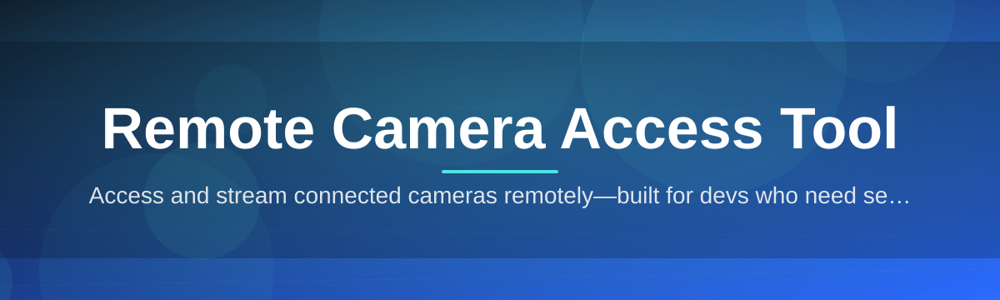
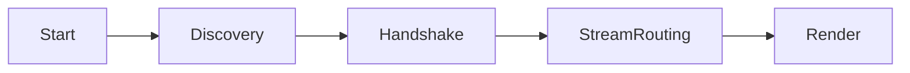

# remote-camera-access-controller 🎥🛰️

  

*One controller, every camera on your network — remote camera access without the enterprise price tag.*

## 🔭 Overview

Most homes and small offices end up with a graveyard of disconnected camera apps — one for the doorbell, one for the baby monitor, one for the workshop webcam, each locked to its own vendor cloud. That fragmentation is the actual problem: it's not that remote camera access is hard, it's that nobody built a single, honest controller that treats every camera as just another device on the network instead of a walled garden.

**remote-camera-access-controller** is a standalone Windows application built to be that single pane of glass. It discovers, connects to, and streams from cameras on your local network or over a secured remote link, giving you one consistent interface instead of five different mobile apps with five different login screens. Under the hood it's architected around a lightweight session broker that negotiates the connection once and then gets out of the way — so video latency stays low and your CPU isn't busy running four Electron apps at once.

This tool is for the tinkerer who wants to actually own their camera setup, the small business owner monitoring a storefront after hours, and the developer who's tired of vendor lock-in and just wants a clean, scriptable remote camera access layer they can trust and understand. No subscriptions, no cloud relay you didn't ask for, no dependencies to wrangle — just download, run, connect.

  

---

## ⚡ What It Actually Does

> [!NOTE]
> Every capability below was built because an existing tool made us angry enough to fix it ourselves. That's the whole origin story of this project.

- **Unified Device Grid** — every camera you've paired shows up as a tile in one dashboard, regardless of brand, protocol, or firmware quirks. No more app-hopping.

- **Adaptive Stream Negotiation** — the controller probes bandwidth and resolution capability on connect and steps the stream up or down automatically, so a laggy hotel Wi-Fi doesn't freeze your feed entirely.

- **Session-Scoped Access Tokens** — every remote connection issues a short-lived session credential instead of a permanent password handshake, so a leaked link doesn't mean permanent exposure.

- **Local-First Recording** — clips and snapshots save to your own disk by default. The cloud is optional, not assumed.

- **Multi-Camera Layouts** — arrange feeds in grid, spotlight, or picture-in-picture layouts, and save layouts per-location (home, office, warehouse).

- **Motion & Event Timeline** — a scrollable timeline marks motion events per camera so you can jump straight to "something happened" instead of scrubbing raw footage.

- **Network Resilience Layer** — automatic reconnect logic with exponential backoff means a flaky router doesn't require you to manually re-pair every camera.

- **Portable Configuration** — your whole setup (camera list, layouts, preferences) lives in one exportable config file, so moving to a new PC takes minutes, not hours.

> [!TIP]
> Pin your most-checked camera to the top-left tile — that position always renders first on cold start, so it's the fastest thing on screen when you open the app.

---

## 🚀 How To Get Started

1. Visit the landing page using the download button above.

2. Grab the latest Windows build — it's a single executable, no installer wizard, no bundled toolbars.

3. Run it. On first launch, the setup wizard scans your local network for discoverable cameras automatically.

4. Add remote cameras manually using their address if they're outside your local subnet, name your layout, and you're watching live within a couple of minutes.

> [!IMPORTANT]
> Windows SmartScreen may flag the executable on first run simply because it's a new, independently signed binary — this is normal for small open-source tools and not an indication of anything malicious. Click "More info" → "Run anyway" if you trust the source.

---

## 🖥️ System Requirements

| Component | Requirement |
|---|---|
| OS | Windows 10 (64-bit) or Windows 11 |
| RAM | 4 GB minimum, 8 GB recommended for multi-camera grids |
| Storage | ~150 MB for the app, more for local recordings |
| Network | Wi-Fi or Ethernet; broadband recommended for remote streams |
| Dependencies | None — fully standalone, no runtime installs required |

  

---

## 🧩 How It Works

The architecture is deliberately boring where it matters and clever only where it counts. Here's the flow from launch to live feed:

1. **Discovery** — the app broadcasts a lightweight query on the local subnet and listens for camera responses, building a device list without needing manual IP entry for most setups.

2. **Handshake** — for each selected camera, the controller negotiates a session: capability check, credential exchange, and stream parameters agreed up front.

3. **Stream Routing** — video packets flow through the session broker, which handles reconnects and bandwidth adaptation transparently to the UI layer.

4. **Render** — the UI grid subscribes to whichever streams are active and lays them out per your saved layout.

5. **Local Log** — events, snapshots, and clips are written to disk in the background, independent of the live view.

---

## 🧯 Troubleshooting

<strong>The app finds my local cameras but not my remote one — why?</strong>

Remote cameras aren't on the broadcast domain, so auto-discovery can't see them. Add them manually via their network address in the "Add Remote Device" panel.

<strong>My stream keeps dropping to low resolution.</strong>

That's the adaptive stream negotiation doing its job — it's reacting to real bandwidth conditions. Check your upstream connection at the camera's location; the bottleneck is almost always there, not the controller.

<strong>Windows says the app is unrecognized.</strong>

This is standard SmartScreen behavior for smaller, independently distributed software. See the note in the Get Started section above.

<strong>Can I run this without a monitor, headless?</strong>

Yes — recording and event logging continue in the background even when the window is minimized or the app is running in tray mode.

<strong>Where are my recorded clips stored?</strong>

By default, in a local folder under your user profile, configurable in Settings → Storage. Nothing leaves your machine unless you explicitly configure a remote destination.

> [!WARNING]
> Only add cameras and endpoints that you own or have explicit permission to access. This tool is a connection manager, not a way to reach devices you don't control.

---

## 🎨 UI / UX Details

- **Themes** — Light, Dark, and an OLED-friendly true-black mode for night monitoring setups.

- **Keyboard Shortcuts**:

  | Shortcut | Action |
  |---|---|
  | `Space` | Pause/resume active feed |
  | `Ctrl + G` | Toggle grid layout |
  | `Ctrl + S` | Save current layout |
  | `Ctrl + F` | Fullscreen selected tile |
  | `Esc` | Exit fullscreen |

- **Settings Panel** — per-camera bandwidth caps, recording retention limits, and notification thresholds for motion events.

- **Tray Mode** — minimizes to the system tray while continuing to record and monitor in the background.

> [!TIP]
> Double-click any tile to snap it to fullscreen instantly — faster than the shortcut when you're navigating with a mouse.

---

## 🤝 Contributing & Community

This started as a personal itch-scratch project and it's stayed genuinely fun to build, which is why community input matters so much here. Bug reports, feature suggestions, and pull requests are all welcome — open an issue first for anything nontrivial so we can align on approach before you spend your evening on it.

> Good first contributions: additional camera protocol support, UI theme polish, and translation groundwork are all great low-friction entry points.

---

## 📄 License

Released under the [MIT License](LICENSE), 2026. Use it, fork it, build on it — just keep the license notice intact.

---

## ⚠️ Disclaimer

This project is provided as-is, for managing and viewing cameras that you own or are explicitly authorized to access. The maintainers assume no responsibility for misuse. Always comply with local laws regarding surveillance and privacy when deploying any remote camera access setup.

  

